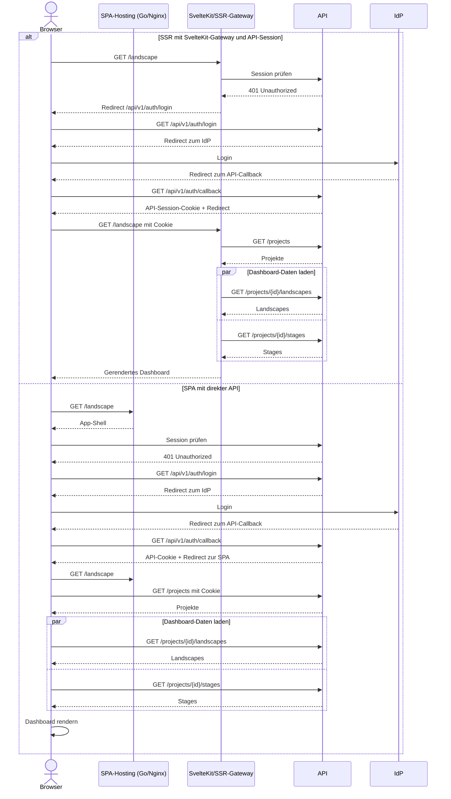

# Landscape Dashboard Authentication

## Alternative Architekturflüsse



## Dashboard-Datenfluss

Der aktuelle UI-Prototyp verwendet beim Laden des Landscape-Dashboards mehrere API-Endpunkte:

1. Das App-Layout lädt mit `GET /projects` die für den Benutzer sichtbaren Projekte.
2. Das Project-Layout prüft, ob `{projectId}` in dieser Projektliste enthalten ist.
3. Die Landscape-Seite startet `GET /projects/{projectId}/landscapes`.
4. Parallel dazu startet sie `GET /projects/{projectId}/stages` über dasselbe `Promise.all`.
5. Die UI führt Landscapes und Stages mit `toLandscapeView()` zum Dashboard-Modell zusammen.

Beim SSR-Szenario ruft SvelteKit diese Endpunkte für den initialen Render auf und aggregiert die Ergebnisse vor der Ausgabe. Nach der Hydrierung kann der Browser weitere Requests direkt an `/api/v1/*` senden. Bei einer direkten SPA führt der Browser alle Requests aus und setzt die Ergebnisse clientseitig zusammen.

## Technische Implikationen

### Rendering und Hydrierung

- SSR und Hydrierung schließen sich nicht aus. SvelteKit kann initial HTML auf dem Server rendern und danach die Anwendung im Browser hydrieren.
- Im SSR-Szenario können Authentifizierung und initiale Datenabfragen vor der HTML-Antwort stattfinden.
- Im SPA-Szenario wird zuerst die App-Shell geladen. Identität und Daten werden anschließend im Browser abgefragt.
- Eine SPA sollte während der initialen Identitätsprüfung einen Splash- oder Loading-State anzeigen. Dadurch muss bei einem `401` kein ungeschütztes Dashboard sichtbar werden.
- Statischer UI-Code ist bei einer SPA nicht durch das Auth-Gate geschützt. Geschützt werden die API-Daten und Operationen; Frontend-Code darf grundsätzlich kein Geheimnis enthalten.

### Cookie-Domänen

- Ein Host-only-Cookie für `api.konfidence.cloud` wird nicht an `frontend.konfidence.cloud` gesendet.
- Bei direktem SPA-Zugriff setzt die API das Session-Cookie für ihren eigenen Origin. Der Browser sendet es nur bei Requests an die API.
- Beim SSR-Modell liegen SvelteKit und `/api/v1/*` hinter einem gemeinsamen öffentlichen Origin. Die API setzt dort ein Host-only-Session-Cookie, das auch bei Seitenaufrufen an SvelteKit gesendet wird.
- SvelteKit reicht bei serverseitigen API-Aufrufen ausschließlich dieses Session-Cookie weiter. OAuth-Tokens und Sessiondaten verbleiben in der API.
- Das Cookie benötigt `Path=/`, damit es auch beim SSR-Aufruf von `/landscape` gesendet wird. Ein `Domain`-Attribut sollte nicht gesetzt werden.
- Ein Cookie sollte mindestens `HttpOnly`, `Secure`, `SameSite=Lax` und `Path=/` verwenden. Schreibende Endpunkte benötigen zusätzlich ein passendes CSRF-Konzept.

### Token und Session

- Auch bei einer SPA müssen OIDC Access-, ID- und Refresh-Tokens nicht im JavaScript-Kontext liegen.
- Der Browser kann ausschließlich ein opakes `HttpOnly`-Session-Cookie halten, während die API Tokens und Sessiondaten serverseitig verwaltet.
- Das Session-Cookie ist nicht das OIDC-Token. Es repräsentiert lediglich die serverseitige API-Session.
- SvelteKit ist weder OAuth-Client noch Session-Owner und benötigt keinen eigenen Token. Es reicht das eingehende Session-Cookie kontrolliert an die API weiter.

### OIDC Redirect URIs

- Die Redirect URI muss exakt beim IdP registriert sein und zum öffentlichen Callback des gewählten Flows passen.
- Beim SSR-Modell zeigt der Callback auf den öffentlich zur API gerouteten Endpunkt, beispielsweise `https://konfidence.cloud/api/v1/auth/callback`.
- Beim direkten SPA/API-Modell zeigt er typischerweise auf `https://api.konfidence.cloud/api/v1/auth/callback`.
- OIDC-Clients können in der Regel mehrere exakt registrierte Redirect URIs besitzen. Alternativ können UI und direkte API-Nutzung getrennte OIDC-Clients verwenden.
- Die API muss den für den jeweiligen Login gültigen Callback kennen oder aus einer vertrauenswürdigen Konfiguration auswählen.
- Redirect URI und Cookie-Domain sind nicht automatisch gekoppelt. Die Cookie-Gültigkeit ergibt sich aus dem Response-Host und den Cookie-Attributen.
- `returnTo` darf nur validierte lokale Ziele akzeptieren, damit kein Open Redirect entsteht.

### CORS und Browser-Zugriff

- Beim gemeinsamen Origin für SvelteKit und `/api/v1/*` ist für Browser-Requests kein CORS erforderlich.
- Bei getrennten SPA- und API-Origins muss die SPA Requests mit `credentials: "include"` senden.
- Die API muss den konkreten Frontend-Origin mit `Access-Control-Allow-Origin` erlauben und `Access-Control-Allow-Credentials: true` setzen.
- `Access-Control-Allow-Origin: *` ist für Requests mit Cookies nicht zulässig.
- Getrennte Origins erfordern eine bewusste Behandlung von Preflight-Requests, CSRF, `SameSite` und erlaubten Origins.

### Traffic und Skalierung

- Beim initialen SSR läuft der Datenzugriff über SvelteKit: Browser zu SvelteKit zu API.
- Nach der Hydrierung können Browser-Requests über `/api/v1/*` direkt zur Go API geroutet werden, ohne die SvelteKit-Runtime zu durchlaufen.
- SvelteKit kann die initialen API-Aufrufe aggregieren, serverseitig parallelisieren und ein bereits gerendertes Ergebnis liefern.
- Im direkten SPA-Modell läuft der Datenverkehr vom Browser unmittelbar zur API. Die statischen UI-Dateien werden voraussichtlich von der Go API oder von Nginx ausgeliefert.
- Ein Reverse Proxy oder Ingress bleibt auch bei einer SPA möglich, ohne dass ein Node-Prozess den API-Traffic verarbeitet.

### Verfügbarkeit und Kopplung

- Im SSR-Modell ist der SvelteKit-Server für Seitenaufrufe Teil des kritischen Datenpfads. Die API und bereits geladene, hydrierte UI können davon unabhängig erreichbar bleiben.
- Die API benötigt keinen laufenden UI-Node-Server. Werden die SPA-Dateien in das Go-Image eingebettet, teilen sich UI und API allerdings Deployment und Release-Zyklus.
- Liefert Nginx die SPA aus und leitet `/api/*` zur Go API weiter, können statische Auslieferung und API-Prozess getrennt betrieben werden, obwohl der Browser einen gemeinsamen Origin sieht.
- Die Resource-Endpunkte der API können unabhängig vom Frontend bleiben. Der Auth-Bereich muss jedoch den öffentlichen Callback, Trusted-Proxy-Verhalten und das Cookie-Modell kennen.
- Mehrere Betriebsarten sind möglich, sollten aber explizit konfiguriert werden. Ein implizites Mischen von UI-Origin- und API-Origin-Sessions führt zu schwer nachvollziehbaren Datenflüssen.

### Zwei Ingresses

Bei getrennten Origins gilt typischerweise:

```text
frontend.konfidence.cloud -> statische SPA oder SvelteKit
api.konfidence.cloud      -> Konfidence API
```

- Eine direkte SPA verwendet das API-Cookie ausschließlich gegen `api.konfidence.cloud`.
- SSR unter `frontend.konfidence.cloud` kann dieses Host-only-API-Cookie nicht aus dem eingehenden Browser-Request lesen.
- SSR mit zwei unabhängigen Cookie-Origins benötigt deshalb ein zusätzliches Session-/Token-Austauschmodell oder lädt die geschützten Daten erst nach der Hydrierung im Browser. Letzteres reduziert den Nutzen von SSR.

### Gemeinsamer Origin mit SvelteKit-Gateway

SvelteKit und API werden hinter einem gemeinsamen Ingress betrieben:

```text
konfidence.cloud/*       -> SvelteKit
konfidence.cloud/api/v1/* -> Go API
```

Damit entstehen:

- Same-Origin-Cookies
- kein Browser-CORS
- direkte Browser-API-Aufrufe
- kein SvelteKit-/Node-Hop für API-Traffic nach der Hydrierung
- ein gemeinsamer OIDC-Callback unter dem öffentlichen Origin

SvelteKit übernimmt SSR und Hydrierung, während Login, Callback, Sessionverwaltung und Autorisierung vollständig in der Go API verbleiben.

### Statisches SPA-Hosting

Für das Deployment sind zwei naheliegende Varianten vorgesehen:

| Variante | Routing | Implikation |
|---|---|---|
| Go API liefert SPA aus | Go bedient SPA-Dateien und `/api/v1/*` | Ein Prozess und Origin; UI und API teilen Image, Deployment und Skalierung |
| Nginx liefert SPA aus | Nginx bedient SPA-Dateien und proxyt `/api/v1/*` zu Go | Ein Browser-Origin ohne CORS; Nginx entlastet Go bei statischen Dateien |

In beiden Varianten können langlebige Hash-Assets mit Browser- und HTTP-Cache-Headern ausgeliefert werden. Für `index.html` ist eine kurze Cache-Dauer sinnvoll, damit neue UI-Versionen zeitnah geladen werden.

Im Diagramm sind SPA-Hosting und API zur Verdeutlichung der Verantwortlichkeiten getrennt dargestellt. Beim Hosting durch Go können beide Teilnehmer derselbe Prozess sein. Bei Nginx bleibt der Browser-Datenfluss direkt zur API, auch wenn Nginx `/api/v1/*` auf Netzwerkebene weiterleitet.

## Vergleich

| Bereich | Aspekt | SSR mit SvelteKit-Gateway | SPA mit direkter API |
|---|---|---|---|
| Architektur | Initiales Rendering | SvelteKit-Server | Browser |
| Architektur | Auth-Prüfung | Vor dem Rendern | Nach Laden der App-Shell |
| Architektur | API-Aufrufe | Initial SvelteKit zu API, nach Hydrierung auch Browser zu API | Browser zu API |
| Architektur | Cookie-Origin | API-Session am gemeinsamen UI-/API-Origin | API; bei gemeinsamem Routing zugleich UI-Origin |
| Architektur | CORS | Nicht erforderlich | Bei Go-/Nginx-Same-Origin nicht erforderlich; bei getrennten Origins erforderlich |
| Architektur | UI-Auslieferung | Laufender Node-Server | Statische Dateien über Go oder Nginx |
| Architektur | Skalierung | SvelteKit und API liegen beim initialen SSR gemeinsam im Request-Pfad | Go teilt UI/API-Skalierung; Nginx kann statische Auslieferung entkoppeln |
| UX | Erster geschützter Seitenaufruf | Auth und Daten können vor der Antwort aufgelöst werden | App-Shell erscheint zuerst, danach Auth- und Datenprüfung |
| UX | Loading State | Initial oft vermeidbar; bei langsamer SSR-Antwort bleibt der Browser auf der vorherigen Seite | Expliziter Splash oder Skeleton ist erforderlich |
| UX | Nicht authentifizierter Zugriff | Redirect kann vor dem Rendern erfolgen | SPA startet und leitet nach dem `401` weiter |
| UX | Dashboard-Daten | Projekte, Landscapes und Stages können gemeinsam ausgeliefert werden | Teilresultate können inkrementell angezeigt werden |
| UX | Folgende Navigationen | Nach Hydrierung sind clientseitige Navigationen möglich | Grundsätzlich clientseitig ohne HTML-Roundtrip |
| UX | Fehlerdarstellung | SvelteKit kann initiale API-Fehler vereinheitlichen | SPA behandelt Fehler und partielle Ergebnisse direkt |
| DX | Lokale Entwicklung | Ein Browser-Origin; weniger CORS-Konfiguration | SPA-Dev-Server benötigt einen API-Proxy oder CORS; Produktion kann Same-Origin sein |
| DX | Datenzugriff | Entwickler müssen zwischen serverseitigen Loads, Remote Functions und hydriertem Browser-Code unterscheiden | Geschützte Daten werden einheitlich im Browser über den API-Client geladen |
| DX | Auth-Debugging | Auth liegt in der API; SSR ergänzt die Weitergabe des Session-Cookies | Kürzerer Browser-API-Datenpfad; CORS ist nur bei getrennten Origins zusätzlich relevant |
| DX | Deployment | Node-Runtime, API und Proxy-Konfiguration erforderlich | SPA-Build wird in das Go-Image oder ein Nginx-Image gepackt; keine Node-Runtime |
| DX | Observability | Initiale SSR- und API-Aufrufe müssen korreliert werden | Browser- und API-Telemetrie müssen korreliert werden |
| Performance | Initiale Darstellung | Kann fertiges HTML liefern und Browser-Waterfalls vermeiden | Go oder Nginx liefert eine cachebare App-Shell; Daten folgen nach JavaScript-Start |
| Performance | API-Latenz | Zusätzlicher SvelteKit-Hop beim initialen SSR; danach direkte Browser-API-Aufrufe möglich | Direkter Hop vom Browser zur API |
| Performance | Serverlast | SvelteKit verarbeitet SSR und initiale Datenabfragen, aber nicht zwingend spätere API-Aufrufe | Go hat geringe statische Last oder Nginx übernimmt die Asset-Auslieferung |
| Performance | Clientlast | Weniger Arbeit bis zur ersten Darstellung, danach Hydrierung | Rendering und Datenzusammenführung erfolgen im Browser |
| Performance | Caching | Serverseitiges SvelteKit-Caching möglich, aber benutzerspezifisch anspruchsvoll | Go oder Nginx setzt Browser-/HTTP-Cache-Header für statische Assets; API-Daten separat |
| Performance | Skalierung | Node- und API-Kapazität müssen gemeinsam für den Request-Pfad betrachtet werden | Bei Go-Hosting skaliert die Asset-Auslieferung mit der API; Nginx kann sie entlasten |

Beide Szenarien sind technisch möglich. SSR mit SvelteKit-Gateway ist sinnvoll, wenn serverseitiges Auth-Gating, ein vollständiger erster Render oder Datenaggregation konkreten UX-Nutzen bringen. OAuth-Client und Session-Owner bleibt dabei ausschließlich die Go API. Eine SPA mit direktem API-Zugriff ist sinnvoll, wenn ein expliziter initialer Loading-State akzeptabel ist und statische Auslieferung ohne Node-Runtime sowie direkte API-Kommunikation wichtiger sind.

Die tatsächliche Performance hängt von Netzwerktopologie, Payload-Größe, Caching, Serverkapazität und Clientgeräten ab. SSR ist nicht automatisch schneller: Es verschiebt Arbeit zum Server und kann Browser-Waterfalls reduzieren, fügt beim initialen Render aber einen SvelteKit-Hop und serverseitige Rendering-Kosten hinzu.
